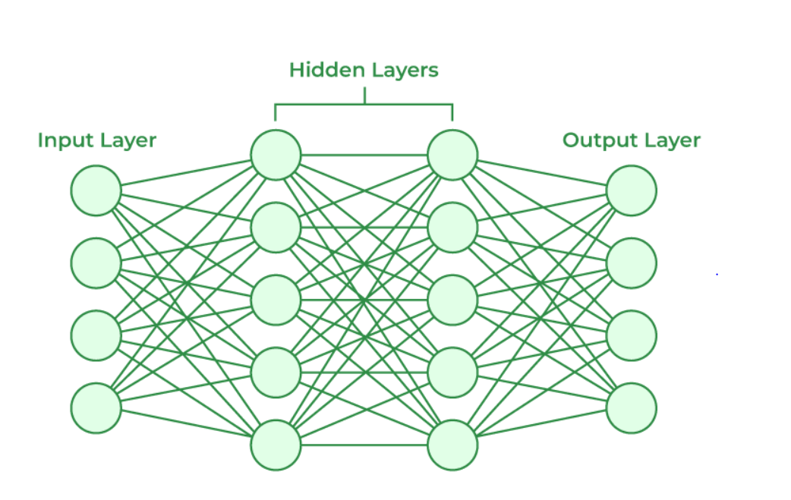

------------------------------------------------------------------------

```{r setup, include=FALSE}
knitr::opts_chunk$set(warning = FALSE, message = FALSE, echo=FALSE,
  fig.align = 'center')
library(DBI)
library(tidyverse)
library(dplyr)
library(scales)
library(tigris)
library(sf)
library(slider)
library(usmap)
library(nnet)
library(pROC)
library(knitr)
library(kableExtra)
library(here)
set.seed(141)

```

```{css html setup, echo=FALSE}
p {
  text-align: justify;
}
body {
  line-height: 1.5;
}
p.caption {
  font-size: 0.85em;
}
caption {
  caption-side: bottom;
}
.title, .author, .date { text-align: center; }
```

```{r functions}
mode <- function(variable){
  u <- unique(variable)
  tab <- tabulate(match(variable, u))
  u[which.max(tab)]
}

NAcount <- function(data){
  colSums(is.na(data)) %>% sort(decreasing = TRUE)
}
```

```{r lodaing dataset}
# Load Data-set
con <- dbConnect(RSQLite::SQLite(), "FPA_FOD_20170508.sqlite")
wildfires_base <- dbGetQuery(con, 'select * from Fires')
dbDisconnect(con)
rm(con)
```

## Abstract

The goal of this report is to build models which can predict whether a notable wildfire will occur in a certain location in a given month. The data-set used is named 1.88 Million US Wildfires, and contains information collected from wildfire reports from a variety of reporting agencies operating on the Federal, state, and local levels.

In order to build the predictive models, the data-set will first need to be prepared for modeling: observations must be filtered, data points validated, the outcome variable defined, and useful predictors must be determined and created. Next, in order to decide on an appropriate model, the data-set will be explored, with a focus on the outcome variable, in order to identify any trends, variations, or other features which may impact models' predictive ability, therefore driving model choice. The models will then be chosen based on the exploratory data analysis: a simple model will act as a baseline for comparison, while a second, more robust model will be chosen to ideally provide a better fit of the data. The models must be fit to the data in a time-aware fashion, in order to avoid data leakage such as predicting past events with future data. To this end, the models will undergo a time-aware cross-validation. The Area Under the Curve (AUC) for each model will then be collected as a measure of prediction accuracy, and the two models will be compared.

**FORMATTING NOTE:**

For ease of reading in the following sections, key words and phrases will be **boldface**, while other important and supporting information will be [underlined]{.underline}*.*

**KEY FEATURES:**

1.  Data Preprocessing
    -   Notable fires defined as \> 300 acres
    -   Spatial-temporal units defined: lat/long cells and months
    -   **Discrepancies between lat/long coordinates and reported state in data-set identified and corrected**
    -   Outcome variable fire_next defined
    -   Lagged and rolling predictors created to track fire history
2.  Exploratory Data Analysis
    -   Fire occurrence rates show strong seasonality
    -   Intense variation in fire rates across years in the study
    -   Gradual increasing trend in fire rates over years
    -   Higher fire rates in southern and western states, lower rates in the north-east and Midwest
    -   **Models must be flexible and non-linear to incorporate seasonality and heterogeneous spatial trends**
    -   **Models must not over-fit strong possibly-random variation and outliers**
3.  Model Choice
    -   Baseline: Logistical Regression
    -   **Second: Neural Network (nnet)**
4.  Model Fitting and Validation
    -   **NNet Decay tuning**
    -   Reported AUCs
    -   AUC plots

------------------------------------------------------------------------

## I. Data Preprocessing

In order to effectively predict whether a notable fire will occur in a given location during the following month, the raw data-set was first modified. Notable alterations included: filtering the data to contain only observations of notable fires; removing extraneous information; constructing spatial and temporal units; defining the outcome variable to be predicted; and creating useful predictors.

The data first needed to be **filtered to contain only notable fires**, since this is the event we would like to predict. However, we must first decide what defines a “notable” fire. For this purpose, [we will be using fires of at least class E,]{.underline} which have a final burned area of [at least 300 acres.]{.underline} After filtering, the data-set contained 24,254 observations, a *size reduction of 98.71%*.

Next, the data-set was pruned to contain only variables relevant to the prediction class. Extraneous variables included reporting agency information, wildfire class (redundant with wildfire size), incident ID, and wildfire name, among others. [The retained columns reported fire size, latitude and longitude coordinates, state, county and FIPS code, year of fire, and discovery day of year (1-365).]{.underline}

At this stage, the data-set was checked to confirm whether any variables **contained missing information (NA's)**, which led to the discovery that [county and FIPS code]{.underline} had missing observations, and *as such were removed.*

```{r 1.Filter}
wildfires_notable <- wildfires_base %>%
  filter(FIRE_SIZE > 300) %>% 
  select(FIRE_YEAR, DISCOVERY_DOY, FIRE_SIZE, LATITUDE, LONGITUDE, STATE, COUNTY, FIPS_CODE)
```

```{r NA table}
NA_table <- tibble(
  Variable = names(wildfires_notable),
  Total_NA = colSums(is.na(wildfires_notable)),
  Percent_NA = percent(Total_NA / nrow(wildfires_notable) )
) %>% arrange(desc(Percent_NA))
NA_table%>% 
  kable(digits=4, align="ccccccccccccccc", 
        caption="Figure 1. Table of total and percent NA observations per column.")%>% 
  kable_styling(full_width = TRUE, position = "center", bootstrap_options = "bordered")

wildfires_notable <- wildfires_notable %>% select(-COUNTY, -FIPS_CODE)

rm(NA_table)
```

In addition, **coordinates were validated** to verify their location in the US, **bringing to light discrepancies between provided coordinates and reported state**. The coordinates of some observations were located in states other than the one from in the data-set. Likely, this discrepancy is due to differences in how agencies report coordinates as opposed to states. For example, if a fire started in state A, but quickly crossed the border into state B and burned there for the majority of its duration, some agencies may report the coordinates of the point of ignition (in state A), but the state where the fire burned the most (state B). Other agencies may report both coordinates and state in state A, or both in B. Regardless, [these inconsistencies make the provided state variable less reliable, and as such it was removed]{.underline}. Geographic labels for **state and county would be determined later, based on each observation’s coordinates**.

```{r trimmed summary}
wildfires_notable <- wildfires_notable %>% select(-STATE)
tibble(FIRE_YEAR = "Calendar year of fire event <br>(1992-2015)", DISCOVERY_DOY = "Day of year fire was discovered <br>(1-365)", FIRE_SIZE = "Final burned area <br>(acres)", LATITUDE = "Latitude coordniates <br>(decimal degrees)", LONGITUDE ="Longitude coordinates <br>(decimal degrees)")   %>% 
  kable(format="html", digits=4, align="ccccccccccccccc", escape=FALSE, 
        caption = "Figure 2. Description of retained variables.") %>% 
  kable_styling(full_width = TRUE, position = "center", bootstrap_options = "bordered")
```

Since the prediction task is to decide whether a notable fire will occur in a given location during the following month, the [month]{.underline} of each observation was created using the discovery day of the year. An [additional variable was constructed]{.underline} which contained both the [month and the year]{.underline} of the fire, in order to [preserve the temporal structure of the data-set.]{.underline} Subsequently, the variable for discovery DOY was removed. Furthermore, [a variable defining whether a fire occurred during that observation was created.]{.underline} Since the prediction goal is to determine whether a fire will occur in the following month, **the outcome will eventually be defined based on this variable**.

```{r mutate dates, Fire_this}
wildfires <- wildfires_notable %>%
  mutate(
    date = as.Date(paste(FIRE_YEAR, DISCOVERY_DOY), "%Y%j"),
    year = format(date, "%Y"),
    month = format(date, "%mm"),
    year_month = format(date, "%Y%m"),
    fire_this = 1
  ) %>% select(-date, -DISCOVERY_DOY, -FIRE_YEAR)
```

The next task was the **creation of spatial-temporal units**, upon which the models will be trained. In order for the models to make accurate predictions, the data-set must contain information on [every spatial-temporal unit in which a notable fire occurred, and all those that did not.]{.underline} If the data-set only contains observations where notable fires occur, the models will obviously always predict a fire, since it knows no alternative.

Since the goal is to [predict fires in a given geographic region in the following month, the temporal piece of the unit was month.]{.underline} As such, a data-frame containing *every month, year, and year-month* during the observation period (1992-2016) was created.

```{r Time units}
# Time
first_fire_date <- as.Date(paste(min(wildfires$year_month), "01"), "%Y%m%d")
last_fire_date <- as.Date(paste(max(wildfires$year_month), "01"), "%Y%m%d")
date <- seq.Date(first_fire_date, last_fire_date, by="month")
all_time <- tibble(date) %>% mutate(
    year = format(date, "%Y"),
    month = format(date, "%m"),
    year_month = format(date, "%Y%m")
  ) %>% select(-date)

rm(first_fire_date, last_fire_date, date)
```

In order to create the geographic component, the definition of spatial units had to be decided. [Counties and latitude-longitude grid cells]{.underline} were the two boundaries that seemed particularly useful. Of the two, [there is significant variation between the sizes of counties]{.underline}, which may confound predictions based on geographic location. As such, a **one-by-one-degree latitude-longitude grid** was used to separate observations into cells. To accomplish this, [the coordinates of each observation were rounded down, to obtain integer cell boundaries.]{.underline} A data-frame of all unique latitude and longitude cell boundaries was then created. [Only cells where at least one notable fire occurred were considered.]{.underline} In order to obtain the full space-time units, the data-frame containing temporal and geographic units were [crossed using matrix multiplication.]{.underline}

```{r grid cells}
# Grid Cells
wildfires_cells <- wildfires %>%
  mutate(
    lat_cell = floor(LATITUDE),
    lon_cell = floor(LONGITUDE)
  ) %>% rename(lat = LATITUDE, lon = LONGITUDE)

all_cells <- wildfires_cells %>% distinct(lat_cell, lon_cell)
```

```{r full cellsmonth}
# Cells-by-month
cells_by_month <- crossing(all_cells, all_time)
rm(all_cells, all_time)
```

```{r grid summary}
tibble(lat_cell = "Latitude cell boundaries <br>(decimal degrees)", lon_cell = "Longitude cell boundaries <br>(decimal degrees)", year = "Calendar year of fire event <br>(1992-2015)", month = "Month of fire event <br>(1-12)", year_month = "Combination of year and month variables")   %>% 
  kable(format="html", digits=4, align="ccccccccccccccc", escape=FALSE, 
        caption = "Figure 3. Description of variables that define spacial-temporal units.") %>% 
  kable_styling(full_width = TRUE, position = "center", bootstrap_options = "bordered")
```

Once the spatiotemporal units were constructed, they were [added to the original data-set by merging across the common variables:]{.underline} year-month and latitude/longitude cell boundaries. For observations created through the construction of the space-time units, [most observational data contained no value (NA), which was rectified by replacing all such data with zeros.]{.underline} Crucially, this means our variable tracking whether a fire occurred during that observation, **fire_this, was still accurate across all observations**.

```{r grid and data}
# Add data
cells_month_data <- merge(
  cells_by_month, wildfires_cells %>% select(-year,-month), 
  by = c("lat_cell", "lon_cell", "year_month"), all.x = TRUE) %>% replace(is.na(.),0)
```

At this point, the geographic labels **state and county were reconstructed using coordinate information**. For observations created through the construction space-time grid, there were no valid coordinates, since a fire did not occur. In addition, the cell boundaries of synthetic observations were often located outside the United States, in the oceans, or were spread across multiple states. As such, [valid coordinates for these observations were synthesized]{.underline} using the [most common valid (observed) coordinates in the same geographic cell]{.underline}. Once every observation had valid coordinates, map data containing state and county boundary coordinates were obtained. [Using these maps, the state and county of each observation was found by determining within which state/county boundaries they occurred]{.underline}.

```{r states and counties, include=FALSE}
# fill in lat and lon columns: for values with no observation, use mode lat, lon of observations in the cell (valid)
valid <- cells_month_data %>% 
  filter(lat != 0 & lon != 0) %>%
  select(lat, lon, lat_cell, lon_cell) %>% rename(valid_lat = lat, valid_lon = lon) %>% 
  group_by(lat_cell, lon_cell) %>%
  summarise(
    valid_lat =mode(valid_lat),
    valid_lon = mode(valid_lon)
  ) %>% ungroup()

wildfires_full <- merge(cells_month_data, valid, by = c("lat_cell", "lon_cell"), all.x = TRUE)
wildfires_full <- wildfires_full %>% mutate(
  lat = ifelse(lat == 0, valid_lat, lat),
  lon = ifelse(lon == 0, valid_lon, lon)
  ) %>% select(-valid_lon, -valid_lat)


# Counties
counties_sf <- counties(resolution = "500k") %>% select(GEOID, geometry) %>%
  st_transform(crs = 4326) %>% rename(FIPS = GEOID)
cells_sf <- st_as_sf(wildfires_full, coords = c("lon", "lat"), crs = 4326, remove = FALSE)
wildfires_full <- st_join(cells_sf, counties_sf, join = st_intersects) %>% st_drop_geometry()

# States
  # Method 1: shape file
state_sf <- states(resolution = "500k") %>% select(geometry, STUSPS) %>%
  st_transform(crs = 4326) %>% rename(state = STUSPS)
cells_sf <- st_as_sf(wildfires_full, coords = c("lon", "lat"), crs = 4326)
wildfires_full <- st_join(cells_sf, state_sf, join = st_intersects) %>% st_drop_geometry()

# Cleanup
rm(valid, counties_sf, cells_c_sf, state_sf, cells_s_sf, cells_by_month, cells_month_data, cells_sf)
```

Both **county and state labels should not be used simultaneously** for prediction tasks, as [the two variables are certainly not independent.]{.underline} Between the two, **state labels are a more useful predictor**, as the occurrence of a fire is [more likely to be affected by laws, policies, and fire management practices at the state-level than the county level]{.underline}. The geographic component affecting wildfire occurrence (such as variations in climate, elevation, and vegetation) is adequately covered by the latitude and longitude cell information, so county labels would not serve this purpose either. Rather, [county labels may be useful during exploratory data analysis]{.underline}, to provide further insight into geographic trends in wildfire occurrence and characteristics.

[Some cell-month units contained multiple observations;]{.underline} that is, multiple notable fires occasionally occurred in the same geographic cell during a single month. In order to ensure the data-set contained only a single observation for each spatiotemporal unit, these **observations were consolidated** by finding the average fire size, and collapsing or finding the mode of other variables. At the same time, **new variables tracking months cyclically** were created by [encoding the original month variable using sin and cos.]{.underline} The encoding of months as cyclical values is crucial, since the models [will not intuitively understand]{.underline}that the twelve months (represented as integers 1-12) occur in a cycle, meaning the 12th month, [December, is temporally close to the first month, January.]{.underline}

```{r consolidate}
# consolidate observations in same cell during same month: avg fire size, total fires, mode state, mode fips
wildfires_full_t <- wildfires_full %>%
  group_by(lat_cell, lon_cell, year_month) %>% 
  summarise(
    year = first(year),
    month = first(month),
    fire_this = first(fire_this),
    avg_size = mean(FIRE_SIZE),
    total_fires = sum(FIRE_SIZE > 0),
    state = mode(state),
    fips = mode(FIPS)) %>%
  ungroup()

```

```{r cyclic months}
wildfires_full_t <- wildfires_full_t %>%
  mutate(
    month_sin = sin(2*pi*(as.numeric(month) / 12)),
    month_cos = cos(2*pi*(as.numeric(month) / 12))
  )
#https://medium.com/@indradeep.chatterjee/cyclic-encoding-in-machine-learning-a-practical-guide-with-code-and-intuition-049846419ccb
```

The definition of our **outcome variable** was then decided. This variable [tracks whether a fire occurs in the same geographic cell during the following month]{.underline}, since this is our prediction goal. This binary variable, fire next, has [a value of 1 if a fire does occur, and 0 if one does not.]{.underline} The values were [created by lagging the fire_this variable by one month,]{.underline} essentially moving the values back a month, within the same geographic cell.

```{r outcome variable}
wildfires_full_t <- wildfires_full_t %>%
  arrange(lat_cell, lon_cell, year_month) %>%
  group_by(lat_cell, lon_cell) %>%
  mutate(
    fire_next = lead(fire_this, n=1L)) %>%
  mutate(
   fire_next = replace_na(fire_next, 0) 
  ) %>% ungroup()
```

Our **final predictor variables** were then created. These variables [track the fire history of each cell,]{.underline} providing additional insight when combined with the current variables, such as fire size and state. The [rolling average fire size]{.underline} of the last three months was created to track recent fire history, while a 12-month average tracked persistent history. [Rolling total fire counts]{.underline} were also created at three and twelve months, for the same reason. Finally, a variable tracking the [total fire count during that month from the previous year]{.underline} was created, to inform how the month of the current year may affect wildfire occurrence.

```{r final predictors}
# year, month
# state, county, cell
# roll3, roll12 avg fire_size (avg fire size over last x mo.)
# roll3, roll12 total fires 
# total fires, lag12 total (how many fires in last 12 mo, how many fires this time last year)

wildfires_full_t <- wildfires_full_t %>%
  group_by(lat_cell, lon_cell) %>%
  arrange(year_month, .by_group = TRUE) %>%
  mutate(
    year = as.numeric(year),
    fire_next = fire_next,
    size_roll3 = slide_dbl(avg_size, mean, .before = 2, .complete = TRUE),
    size_roll12 = slide_dbl(avg_size, mean, .before = 11, .complete = TRUE),
    total_roll3 = slide_dbl(total_fires, sum, .before = 2, .complete = TRUE),
    total_roll12 = slide_dbl(total_fires, sum, .before = 11, .complete = TRUE),
    total_lag12 = lead(total_fires, n = 12L)
  ) %>% ungroup() %>% mutate(across(everything(), ~replace_na(.x, 0)))


```

A **summary of all predictors** in the final data-set follows:

```{r predictors}
tibble( 
  Variable = c("lat_cell", "lon_cell", 
               "year", "month_sin", "month_cos", 
               "size_roll3", "size_roll12", "total_roll3", "total_roll12", "total_lag12", 
               "fire_this"), 
        Description = c("Latitude cell boundaries (decimal degrees)", "Longitude cell boundaries (decimal degrees)", 
                        "Calendar year of fire event (1992-2015)", "Sin-encoded cyclical month", "Cos-encoded cyclical month", 
                        "Three month rolling average fire size", "Twelve month rolling average fire size", 
                        "Three month rolling total fire count", "Twelve month rolling total fire count", 
                        "Twelve month lagged total fire count",
                        "Tracks if a fire occured in this cell during this month (0,1)") )   %>% 
  kable(format="html", digits=4, align="ccccccccccccccc", escape=FALSE, 
        caption = "Figure 4. Descriptions of all predictor variables.") %>% 
  kable_styling(full_width = TRUE, position = "center", bootstrap_options = "bordered")
```

In addition, the following variables were **retained for further exploratory data analysis**, but [will not be used as predictors:]{.underline}

```{r non-predictors}
tibble( 
  Variable = c("month", "year_month", "avg_size", "fips"), 
        Description = c("Month in which the fire occured (1-12)", "Combination of year and month variables", "Average final burned area for the current cell, month, and year", "Unique five-digit code which denotes county") )   %>% 
  kable(format="html", digits=4, align="ccccccccccccccc", escape=FALSE, 
        caption="Figure 5. Descriptions of non-predictor variables.") %>% 
  kable_styling(full_width = TRUE, position = "center", bootstrap_options = "bordered")
```

------------------------------------------------------------------------

## II. Exploratory Data Analysis

In order to inform modeling decisions, exploratory data analysis was performed on the final data-set. The goal of this analysis is to identify **any trends, outliers, or other features in the data which may affect a model's ability to fit**. For example, if strong seasonality is exhibited by the data, a model like linear regression (which assumes a linear relationship between predictors and outcomes) would be inappropriate, as it is incapable of accurately modelling cyclical relationships. A model with more flexibility and no assumption of linearity would be more appropriate. The exploratory data analysis will [focus on fire occurrence rates (fire_this and fire_next) since these are the most important factors to base modeling decision on.]{.underline}

We will first investigate temporal trends in the data-set. There are [two main temporal units of interest: months and years.]{.underline} Plotting the outcome variable across months and years will [provide insight as to whether the data exhibits strong seasonality, and whether there are noticeable trends across time,]{.underline} respectively.

### Temporal Patterns

Temporal patterns in wildfire occurrence will first be observed. The two temporal scales of interest in this analysis are months and years. Examining monthly trends in fire rates will [reveal whether the data-set has strong seasonality]{.underline}, while the years will [display how trends in fire rates changed over time]{.underline} during the observation period.

#### Monthly Trends

The following visual plots fire occurrence rates across months. The average current fire rate (fire_this) and next-month fire rate (fire_next) were calculated across each month in the data-set, and both were plotted simultaneously.

```{r occurance month plot, fig.cap = "Figure 6. Plot of average this-month (red barplot) and next-month (black line) fire rates across months."}
# Temporal
## Monthly: seasonal trends

fnext_monthly <- wildfires_full_t %>% arrange(month) %>% group_by(month) %>%
  summarize(
    avg_next = mean(fire_next),
    avg_this = mean(fire_this)
  )

ggplot(fnext_monthly, aes(x=month)) +
  geom_bar(aes(y=avg_this, color="Average This-Month Fire Rate"), stat="identity", group=1, fill="red") +
  geom_line(aes(y=avg_next, color = "Average Next-Month Fire Rate"), group=1, size=1.2) +
  theme_minimal() +
  scale_color_manual(name = "Legend", values = c("Average This-Month Fire Rate" = "Red", "Average Next-Month Fire Rate" = "black") ) +
  labs(title = "Average Fire Rate by Month (Seasonal Trends)", x = "Month", y = "Average Fire Rate")

rm(fnext_monthly)
```

From this visual, we can easily determine that **wildfire occurrence rates exhibit strong seasonality**. [Occurrence rates are highest in the summer months]{.underline}, especially June through August, when conditions are more favorable for wildfires due to decreased precipitation and increased temperature. By contrast, wildfire rates are much [lower during the winter months]{.underline}, which are generally cooler and wetter. This strong seasonality is important to determine, as **our choice of models will need to be narrowed to those that can adequately handle cyclical processes**. Crucially, this means **avoiding models that rely on rigid assumptions of linearity.**

#### Yearly Trends

Yearly average wildfire occurrence rates were plotted in a similar manner to the monthly rates.

```{r occurance year plot, fig.cap = "Figure 7. Plot of average this-month (red barplot) and next-month (black line) fire rates across years."}
## Years: over-time trends
fnext_yearly <- wildfires_full_t %>% arrange(year) %>% group_by(year) %>%
  summarize(
    avg_next = mean(fire_next),
    avg_this = mean(fire_this)
  )

ggplot(fnext_yearly, aes(x=year)) +
  geom_bar(aes(y=avg_this, color="Average This-Month Fire Rate"), stat="identity", group=1, fill="red") +
  geom_line(aes(y=avg_next, color = "Average Next-Month Fire Rate"), group=1, size=1.2) +
  scale_x_continuous(breaks = fnext_yearly$year[seq(1, nrow(fnext_yearly), by = 4)]) +
  theme_minimal() +
  scale_color_manual(name = "Legend", values = c("Average This-Month Fire Rate" = "Red", "Average Next-Month Fire Rate" = "black") ) +
  labs(title = "Average Fire Rate by Year (Trend Over Time)", x = "Year", y = "Average Fire Rate")

rm(fnext_yearly)
```

This plot illustrates a **large amount of variation** across years, with [extreme peaks and troughs occurring within a relatively short time period]{.underline}. Even in years when there are not such extremes, I would [hesitate to describe the trend as linear.]{.underline} This signifies that there is **likely extreme observations in the data-set**, which may challenge a model's ability to accurately predict wildfire occurrence. **It will be crucial to avoid over-fitting the models**, and as such [models which are less prone to over-fitting or can be adjusted to mitigate it should be chosen.]{.underline}

The plot does seem to show a **gradual upwards trend in wildfire occurrence**, likely reflecting the [slowly changing climatic and environmental conditions]{.underline} over the 24 observed years.\

### Geo-spatial Patterns

Geo-spatial patterns will now be inspected by creating a heat map of average next-month wildfire occurrence rates across three different spatial levels of decreasing coarseness: state, grid-cell, and county.

#### States

Between the three geographic levels, states have the largest boundaries, which will likely cause variation in occurrence rates to be less extreme relative to the finer levels.

```{r occurance states map, fig.cap = "Figure 8. Heatmap of next-month fire rates by state (including Puerto Rico)." }
# Spatial
## States
states_map <- us_map(regions = "states") %>% rename(state = abbr)

states_fires <- wildfires_full_t %>% group_by(state) %>%
  summarize(
    avg_next = mean(fire_next)
  )%>% ungroup()
s_fires_map <- left_join(states_map, states_fires, by="state")

ggplot(s_fires_map) +
  geom_sf(aes(fill = avg_next)) +
  scale_fill_viridis_c(limits=c(0,0.15), breaks = c(0, 0.05, 0.1, 0.15)) +
  theme_void() +
  labs(title = "Average Next-Month Wildfire Rate of US States and Puerto Rico",
       fill = "Average Next-Month Fire Rate")
```

Here, states are colored on a gradient of average next-month wildfire rates, with an upper bound of 0.15. Notably, [the only states that do not have any observations are New Hampshire, Vermont, and Rhode Island.]{.underline}

At the state level, broad trends in wildfire occurrence rates may be determined, which will be inspected further at the finer levels. **Occurrence rates seem to be highest in the western and southern states**, where the climate is generally drier and warmer year-round, and **lowest in the Midwest and north-eastern states,** which tend to be cooler and wetter. This trend [follows a fairly smooth gradient]{.underline}, with fire rates gradually decreasing towards the inland and northern states. This outcome if fairly intuitive, and not at all surprising.

What may be surprising is [Florida's fire rate]{.underline}, which is approaching 0.15 and [is the highest of any state.]{.underline} Florida has an intense seasonal dry season, which has a massive effect on wildfire occurrence due to the large amount of vegetation present in much of the state, which becomes tinder in the summer. While Florida certainly has many wildfires, their lead over other states may still come as a surprise, especially since [fires in states such as Alaska, California, and Hawaii more commonly make national news.]{.underline} This is likely because fires in the mentioned states tend to be significantly more devastating than Florida fires; [while Florida has notable fires more frequently, they are not as nationally impactful.]{.underline}

#### Grid Cells

At the grid cell level, the broad trends observed in the state heat map may be scrutinized more closely.

```{r occurance cells map, fig.cap = "Figure 9. Heatmap of next-month fire rates by latitude-longitude cells."}
## Cells
cells_fires <- wildfires_full_t %>% group_by(lat_cell, lon_cell) %>%
  summarize(
    avg_next = mean(fire_next)
  )%>% ungroup()

ggplot(cells_fires, aes(x=lon_cell, y=lat_cell, fill=avg_next)) +
  geom_tile() +
  scale_fill_viridis_c(limits=c(0,0.4), breaks = c(0, 0.1, 0.2, 0.3, 0.4)) +
  theme(aspect.ratio = 53/113) +
  theme_minimal() +
  labs(title= "Average Next-Month Fire Rate for Grid Cells",
       x= "Latitude", y="Longitude", fill = "Average Next-Month Fire Rate")
```

From the grid map, the same general trends hold true when compared to the state map: [higher fire occurrence rates are generally concentrated in the west and south]{.underline}*.* With this plot, however, it becomes obvious that **much of the north-eastern United States did not experience any notable fires** during the course of the observational period (as far as reported fires go, anyway). This was not immediately obvious from the state map. In addition, the spatial trends of wildfire occurrence are clearer to see: **higher occurrence rates are generally clustered in particular locations** in the south and west, rather than being more evenly spread/ This displays the fact that **fire rates do not follow a gradual gradient** towards lower rates in the north-east, thought the broad statement remains true.

We may conclude that **fire rate occurrences do not follow a linear trend towards a particular direction**. Therefore, when choosing a model to predict fire occurrence, [those that rely on assumptions of linearity should likely be avoided where possible.]{.underline} Rather, [more flexible models with fewer or different assumptions ought to be used.]{.underline}\

#### Counties

The finest geographic scale which will be investigated is counties. Through this plot, we may be able to [further dissect the heterogeneity]{.underline} observed in the latitude/longitude plot, and [pinpoint where higher fire rates seem to be concentrated.]{.underline}

```{r occurance counties map, fig.cap = "Figure 10. Heatmap of next-month fire rates by county."}
## Counties
counties_map <- us_map(regions = "counties")
counties_fires <- wildfires_full_t %>% group_by(fips) %>%
  summarize(
    avg_next = mean(fire_next)
  )%>% ungroup()
c_fires_map <- left_join(counties_map, counties_fires, by="fips")

ggplot(c_fires_map) +
  geom_sf(aes(fill = avg_next)) +
  scale_fill_viridis_c(limits = c(0,1), breaks = c(0, 0.50, 1)) +
  theme_void() +
  labs(title = "Average Next-Month Wildfire Rate of US Counties",
       fill = "Average Next-Month Fire Rate")
```

```{r EDA cleanup}
rm(states_map, counties_map, states_fires, counties_fires, cells_fires, s_fires_map, c_fires_map, s_size_map, states_size)
```

Immediately, what stands out most is the [high number of counties in which no notable fires occurred]{.underline} during the observation period. This makes it even more obvious that the north-east and mid-western US experiences by far the fewest fires. In addition, most of Puerto Rico either did not experience any fires, or they were not reported.

This heat map also displays how **certain counties in particular experience very high fire rates**, with neighboring counties also experiencing higher rates. It seems as though **there are certain fire "hot spots."** Likely, these are either areas which have conditions particularly conducive to fires (such as brush or scrub land), or are highly populated areas where fires are frequently caused by humans. Regardless, the **heterogeneity and uneven spread of fire occurrence rates** is even more obvious with the fine-scale plot.

### Summary

In general, wildfire occurrence displays **strong seasonality and intense variation** over years, with a **gradual increasing trend**. In addition, **while there is a general trend towards higher fire rates in the southern and western US, the [gradient is not even or particularly gradual.]{.underline}** Rather, there are **certain locations** in the west and south which seem to **experience significantly higher fire rates**, with rates generally decreasing away from these spots. Notably, [much of the north-east and Midwest United States did not experience any notable fires during the observation period.]{.underline}

Based on these observations, it will be crucial to **choose predictive models that have some degree of flexibility, and do not rely on rigid assumptions of linearity**. Furthermore, **models which are prone to over-fitting should be avoided**, due to the large degree of seemingly-random variation and significant outliers in fire occurrence rates.\

------------------------------------------------------------------------

## III. Modeling Choices

In order to create a predictive model for this data-set, both a simple baseline model and a more complex, robust model were chosen. For the baseline, a **simple logistical regression model** was picked.

Logistical regression is used to [predict the outcome of a categorical variable.]{.underline} As such, it is viable for our purposes, since [our outcome is a binary variable]{.underline}: either a fire occurs or it does not. This model is also very simple and commonplace, making it a good choice for a baseline model to compare our second choice to. These models are also **relatively flexible**- [the seasonality, gradual trend, and spatial trend observed in the exploratory data analysis may be adequately accounted for.]{.underline} However, logistical regression relies on the **assumption that all continuous predictors have a linear relationship with the log-odds of the outcome**. This relationship is rather simple to determine using the **Box-Tidwell** test. In the following table, **if a logged predictor is statistically significant (Pr(\>\|z\|) \< .05), the assumption of a linear relationship is not met**:

```{r boxTidwell}
wildfires_cont <- wildfires_full_t %>% select(size_roll3, size_roll12, total_roll3, total_roll12, total_lag12, total_fires, fire_next) %>%
  mutate(across(-fire_next, ~.x + 1))

box_tidwell <- glm(fire_next ~ size_roll3 + log(size_roll3) +
                               size_roll12 + log(size_roll12) +
                               total_roll3 + log(total_roll3) +
                               total_roll12 + log(total_roll12) +
                               total_lag12 + log(total_lag12) +
                               total_fires + log(total_fires),
                   data = wildfires_cont,
                   family = binomial)

as_tibble(summary(box_tidwell)$coefficients[,"Pr(>|z|)", drop=FALSE], rownames = "Variable") %>%
  mutate(
    `Pr(>|z|)` = format(`Pr(>|z|)`, digits = 3),
    Significance = case_when(as.double(`Pr(>|z|)`) < 0.05 ~ "Significant", .default = "Not Significant") ) %>% 
  slice(-1, -2, -4, -6, -8, -10, -12)%>% rename("Pr( >z )" = "Pr(>|z|)")   %>% 
  kable(format="html", digits=4, align="ccccccccccccccc", escape=FALSE, 
        caption = "Figure 11. Box-Tidwell results for all logged continuous predictors.") %>% 
  kable_styling(full_width = TRUE, position = "center", bootstrap_options = "bordered")

rm(box_tidwell)
```

The **EDA previously indicated that the data-set likely doesn't have linear relationships**, due to the [strong seasonality and uneven spread]{.underline} of wildfire occurrence across the south-west, and this table solidifies that thought. While the logistical regression model will [serve as a good baseline and may perform adequately, it is likely not the best model for this data-set]{.underline}.

For the second model, a **simple neural network** was used. Neural networks have the advantage of being [unbound by assumptions such as linearity of predictors]{.underline}. The model is [flexible enough to be able to learn trends observed in the exploratory data analysis]{.underline}: the **strong seasonality**, gradual increase over years, and more **uneven spread of high occurrence rates in the south-western US**. This is potentially a source of [benefit over the logistical regression model, which is held back somewhat by its assumption of linearity, and is not quite as flexible.]{.underline}

In addition, the neural network has the possibility of being more **finely-tuned** to the [significance of variation]{.underline} in the predictors as the weights of each variable are adjusted for accuracy over every iteration. However, this can be a [double-edged sword]{.underline}: the neural network has the possibility of ***over-fitting*** the data and becoming [*too sensitive to variation*]{.underline}. This is especially important for this data-set, which **has** **extreme variations**, particularly in wildfire occurrence over years. In an effort to avoid this, **a “decay” parameter will be added** to the model, which helps [limit the size of the weights by penalizing larger values.]{.underline} This limitation is based on the idea that [a more complex model will be more prone to over-fitting]{.underline}, so the [simplest possible model]{.underline} that accurately portrays the relationship is pursued. In many ways, the function f(x) = 0 is the simplest possible form a polynomial, such as the one the weights are used to create, can take. As such, [the further a polynomial is from 0, the more complex it may be considered, making the minimization of weights key to a simple model.]{.underline}

Furthermore, since the weights of variables are [randomly initialized and adjusted]{.underline}, the model [may be very inconsistent across batches of training data]{.underline}. To mitigate this, the [neural network will re-fit the data a few separate times,]{.underline} and the weights that produced the most accurate model will be used.

Notably, a **major downside** of neural networks is the [length of time they take to run]{.underline}. The network used in this prediction, from the **"nnet" package**, is [particularly slow and not very sophisticated]{.underline}. The amount of iterations and hidden units necessary to produce a reliable model results in a run-time that is [significantly longer than fitting the logistical regression model.]{.underline}

The **size of the hidden layer** and the **maximum allowed number of iterations** are very important parameters in the creation of a neural network, and have a large effect on run-time, as previously mentioned. In order to understand the relevance of the size parameter, [it is important to have an idea of the structure of neural networks]{.underline}. A neural network such as nnet has **three main components**: [the input layer, the hidden layers, and the output layers]{.underline}. The input layer and output layers are intuitively named; they handle the input data and output data respectively. [The hidden layers are the neurons which perform computation and weight adjustment.]{.underline} During each iteration, the weights of each neuron are adjusted in order to minimize the error of the model.

```{r, echo=FALSE, fig.cap= "Figure 12. Schematic of simple neural network. Source: https://www.geeksforgeeks.org/r-language/neural-networks-using-the-r-nnet-package/", fig.width=5, out.width="70%", fig.align="center"}

```

**The size parameter defines the size of the hidden layers**- [a *larger size generally results in a more sophisticated neural network*]{.underline} that may be [more capable of learning complex trends and relationships]{.underline}, such as the strong seasonality and heterogeneous geographical spread **noted in the EDA**. The [maximum number of iterations defines how many times the model is allowed to run]{.underline} before stopping. If the model converges before the max iterations is reached, the model will still stop- the maximum puts an [upper bound on run-time.]{.underline}

In order to [balance the accuracy of the model and run-time,]{.underline} a hidden layer **size of 2** and a **maximum allowed iterations of 500** were chosen.\

------------------------------------------------------------------------

## IV. Model Fitting and Validation

In order to ensure the models can accurate predict future wildfire occurrence, the models **must be validated in a time-aware fashion**. That is, we must [avoid using data from the future to predict the past.]{.underline} In order to do this, [training and test data must be split across time]{.underline}; all observations [prior to a given year will be used as training data]{.underline}, while the *y*[ear immediately following the last training year will be used to test the models]{.underline}. The year immediately following the training period will be used as opposed to the remainder of the data-set because *o*[ur prediction goal is to determine wildfire occurrence in the short-term future]{.underline}. It is important that model testing reflects this goal.

We will perform a **cross-validation** on the models using the time-aware training-test split mentioned above. In order to cross-validate the models, *t*[he full data-set will be split into training and test data a number of times]{.underline}, and the models will be fit on each batch of data. In practice, the first training data set will contain the observations belonging to the three oldest years (1992, 1993, 1994), and tested on the following fourth year (1995). The next training data-set will contain the four oldest years, and will be tested on the fifth. [This process will continue until the test year is the last year in the data-set (2015).]{.underline} **When each model is tested, the AUC (Area Under the Curve) will be computed and collected**, in order to determine the accuracy of the models in each training-test split. These AUCs will be reported after the models have finished being fit entirely.

### Decay Tuning

Before the models can be fit, however, **the neural network must be tuned** to some extent. Specifically, an adequate **decay value** must be chosen. This value is important for the reasons mentioned above- namely, it will help the model [avoid over-fitting.]{.underline} In order to determine a good decay value, the base neural network will be [trained and tested against roughly half the years]{.underline} in the data-set [(test year 2005)]{.underline}, with [five different decay values]{.underline} (0.001, 0.01, 0.1, 0.5, 0.75). The decay value which [results in the largest AUC will be used in the full model fitting]{.underline}. The [other important parameters]{.underline}, size of hidden layer and max iterations, will be set to the same values which will used in the final fitting, 2 and 500 respectively. These values give the model a [good chance of learning the trends and variations in the data-set, while balancing run-time]{.underline} to some extent. The neural network will be [trained three times on each decay value]{.underline} and the best performing model will be kept, in order [to avoid pitfalls caused by the random nature of weight adjustment.]{.underline}

```{r decay tuning, include = FALSE}
prediction_formula <- fire_next ~ size_roll3 + size_roll12 +
                     total_roll3 + total_roll12 +
                     total_lag12 + total_fires +
                     lat_cell + lon_cell + state +
                     year + month_sin + month_cos

wildfires_full_scaled <- wildfires_full_t %>% select(
  fire_next, size_roll3, size_roll12, total_roll3, total_roll12, total_lag12, total_fires,
  lat_cell, lon_cell, state, year, month_sin, month_cos ) %>% mutate(fire_next = as.factor(fire_next))

to_scale <- c('total_roll3', 'total_roll12', 'total_lag12', 'total_fires',
  'lat_cell', 'lon_cell', 'month_sin', 'month_cos')


t_end = 2004
t_year = 2005

train <- wildfires_full_scaled %>% filter(year <= t_end) %>% mutate(across(to_scale, scale))
test <- wildfires_full_scaled %>% filter(year == t_year) %>% mutate(across(to_scale, scale))

decay_tibble <- tibble(Decay = double(), AUC = numeric())
  for (d in c(0.001, 0.01, 0.1, 0.5)) {
    auc = 0
    for (i in 1:3){
      model <- nnet(prediction_formula, data = train, size = 2, maxit = 300, decay = d)
      prob <-  predict(model, newdata = test, type = 'raw')
      roc <- roc(test$fire_next, prob, quiet = TRUE)
      auc_n <- as.numeric(auc(roc))
      if (auc_n > auc){
        auc = auc_n
      }
    }
    decay_tibble <- decay_tibble %>% add_row(Decay = d, AUC = auc)
  }
rm(t_end, t_year, train, test, model, d, i)
```

```{r decay tibble}
decay_tibble   %>% 
  kable(format="html", digits=4, align="ccccccccccccccc", escape=FALSE, 
        caption="Figure 13. Tibble displaying each decay value's associated AUC.") %>% 
  kable_styling(full_width = TRUE, position = "center", bootstrap_options = "bordered")
```

Based on these results, the **decay value of 0.5** works best for this model and data-set. As such, this will be the value used in the final fitting process.\

### Model Fitting, Validation, and Diagnostics

As stated prior, the neural network in the final model fit will have a [decay value of 0.5, a hidden layer size of 2, and a max iterations of 500]{.underline}. The neural network will be [fit three times,]{.underline} as before, in order *to avoid the worst random chances*.

```{r model fitting, include = FALSE}
# Note: has printed sections for experimental purposes
years <- sort(unique(wildfires_full_scaled$year))
min_years = 3

folds <- tibble(
  train_end = years[ (min_years) : (length(years) - 2) ],
  test_year = years[ (min_years + 1) : (length(years) - 1) ] ) %>%
  mutate(
    log_auc = map2_dbl(train_end, test_year, function(t_end, t_year){
      if (t_year == 1995){
        cat("log processing...\n")}
      cat("test year: ", t_year, "\n")
      train <- wildfires_full_scaled %>% filter(year <= t_end)
      test <- wildfires_full_scaled %>% filter(year == t_year)

      log_fit <- glm(prediction_formula, family = binomial(link = 'logit'), data = train)

      log_prob <-  predict(log_fit, newdata = test, type = 'response')
      log_roc <- roc(test$fire_next, log_prob, quiet = TRUE)
      auc_log <- as.numeric(auc(log_roc))
      auc_log
       }   ),
    nnet_auc = map2_dbl(train_end, test_year, function(t_end, t_year){
      if (t_year == 1995){
        cat("\n\nnnet processing...\n")}
      cat("\n\ntest year: ", t_year, "\n\n")
      train <- wildfires_full_scaled %>% filter(year <= t_end) %>% mutate(across(to_scale, scale))
      test <- wildfires_full_scaled %>% filter(year == t_year) %>% mutate(across(to_scale, scale))
      auc_nnet = .5
      for (i in 1:3){
        cat("\nround", i, ":\n")
        nnet_fit <- nnet(prediction_formula, data = train, size = 2, maxit = 500, decay = 0.5, trace=TRUE)
        nnet_prob <-  predict(nnet_fit, newdata = test, type = 'raw')
        nnet_roc <- roc(test$fire_next, nnet_prob, quiet = TRUE)
        auc_nnet_new <- as.numeric(auc(nnet_roc))
        if (auc_nnet_new > auc_nnet){
          auc_nnet = auc_nnet_new }
      }
        auc_nnet
      }  )
    )
#https://purrr.tidyverse.org/reference/map2.html
#https://www.geeksforgeeks.org/r-language/generalized-linear-models-using-r/
#https://www.geeksforgeeks.org/r-language/neural-networks-using-the-r-nnet-package/
```

```{r AUC tables}
folds %>% rename("Training End Year" = train_end, "Test Year" = test_year, "Log AUC" = log_auc, "NNet AUC" = nnet_auc)   %>% 
  kable(format="html", digits=4, align="ccccccccccccccc", escape=FALSE, 
        caption ="Figure 14. Table of both models' AUC for each validation.") %>% 
  kable_styling(full_width = TRUE, position = "center", bootstrap_options = "bordered")

tibble("Model" = c("Logistical Regression", "Neural Network"), "Average AUC" = c(mean(folds$log_auc), mean(folds$nnet_auc)))    %>% 
  kable(format="html", digits=4, align="ccccccccccccccc", escape=FALSE, 
        caption = "Figure 15. Table of each model's average AUC across full cross-validation.") %>% 
  kable_styling(full_width = TRUE, position = "center", bootstrap_options = "bordered")
```

\
According to the reported AUCs, **the neural network performs better than the logistical regression model** by an average of about `r round(mean(folds$log_auc) / mean(folds$log_auc) * 100, 2) - 100`%.

This outcome is understandable, as [the neural network was specifically chosen for its ability to fit data-sets with complex relationships and interactions]{.underline} between the predictors and the outcome. The neural network has a [high degree of flexibility]{.underline} due to the nature of its structure, with each neuron in the hidden layer working to minimize error with each iteration, with [comparatively less regard for rigid assumptions]{.underline} of relationship. [The logistical regression model,]{.underline} on the other had, is more [*relatively rigid*,]{.underline} and is [constrained by the assumption]{.underline} that the continuous predictors have a linear relationship with the log-likelihood of the outcome. As was tested with the Box-Tidwell method, [this assumption does not necessarily hold true for this data-set, so it makes sense that this model under performed.]{.underline}

```{r diagnostic plots, fig.cap = "Figure 15. Plot of logistical regression (red) and neural network (blue) AUC for each validation (test) year."}
ggplot(folds, aes(x=(test_year))) +
  geom_line(aes(y=log_auc, color = "Log Regression"), size = 1) +
  geom_point(aes(y=log_auc, color = "Log Regression"), size = 2) +
  geom_line(aes(y=nnet_auc, color = "Neural Network"), size = 1) +
  geom_point(aes(y=nnet_auc, color = "Neural Network"), size = 2) +
  scale_color_manual(name = "Model", values = c("Log Regression" = "coral1", "Neural Network" = "cyan3")) +
  labs(
    title = "AUC of Prediction Models across Validaiton Years",
    x= "Test Year", y = "AUC") +
  theme_minimal()

```

Interestingly, the plots of the AUCs of both models shows that, while *e*[ach model had significant variation across training sets,]{.underline} the **variation is strangely consistent across models**. Certain years had lower prediction accuracy across both data-sets, while other years performed significantly better. [Comparing the shape of this plot with the **plot of fire rates across years from the EDA**]{.underline} reveals that there may be some correlation. The shape of both plots [follow a similar general shape,]{.underline} having peaks and troughs in the same relative time periods. This implies that the strong variation in AUC, and therefore prediction accuracy, is [likely caused by the extreme variations in the occurrence of fires]{.underline} in the data-set- that is, the **models have a hard time accurately predicting extreme events and variations** in wildfire occurrence rates. This is understandable, as these extreme fluctuations are [likely caused by a number of factors with complex relationships]{.underline}, many which were [not included in the data-set]{.underline} as predictors. Such variables might include climatic conditions, federal and state policy changes, or changes in geographic features like vegetation cover or forest density.\

------------------------------------------------------------------------

## V. Summary

Before modeling tasks could be started, the original data-set had to be altered. Crucially, [only notable fires were included, an outcome variable and spatial-temporal units were defined, and useful predictors were created or extracted from the data]{.underline}. In addition, **discrepancies between reported latitude-longitude coordinates and listed state were identified**. Location labels for state and county were instead created from observations' latitude-longitude coordinates.

With the data restructured, exploratory data analysis (EDA) was undergone in order to inform predictive model choice. This analysis revealed **strong seasonality** in wildfire occurrence rates, as well as **significant variation over years**, [with a gradual upwards trend.]{.underline} In addition, fire rates were found to be generally **higher in the south and west United States**, while rates tended to be [lower in the Midwest and north-east]{.underline}. In fact, **much of the Midwest and north-east did not experience any notable fires** over the 24-year observation period. The general tend towards higher rates in the southwest **did not follow a smooth gradient**, rather [certain locations appeared to be "hot spots"]{.underline} which had extremely high overall fire rates, and areas further from these hot spots generally had lower rates. In summary, [the data showed strong seasonality and temporal variation with a slow increase in fire rates over time, as well as a geographically uneven spread of high fire rates, with a general trend of higher fire occurrence rates in the southern and western United States.]{.underline}

Based on the information gained through the EDA, models which had a certain degree of **flexibility** and **did not have a rigid reliance on assumptions of linearity** were determined to be ideal. This is due to the [strong seasonality and uneven spatial spread of wildfire occurrence rates in time]{.underline}*;* neither characteristic describes linearity. In addition, **models prone to over-fitting needed to be avoided or adjusted,** due to the strong variation in occurrence rates; [models too sensitive to these variations would under perform.]{.underline}

Based on these criteria, a **logistical regression** model was chosen as a baseline, which a neural network would be compared to. The logistical regression model was chosen because it has [higher flexibility and less rigid assumptions than linear regression,]{.underline} while still being a rather simplistic model which would serve as a good baseline. However, logistic regression [relies on an assumption of linearity]{.underline} between continuous predictors and the log-likelihood of the outcome, which was [determined to not hold true of this data-set using a Box-Tidwell test.]{.underline} As such, the logistical regression model was determined to likely not be the best fit model, though it would still be a useful benchmark.

The **neural network** was chosen due to its [high degree of flexibility and lack of rigid assumptions]{.underline}. These characteristics would allow the model to [learn the complex relationships between predictors and outcome]{.underline}. However, neural networks are sometimes **in danger of over-fitting**. To mitigate this, [the model needed to be tuned.]{.underline} In addition, neural networks have a **significantly longer run-time** than logistic regression models. [The size of the parameters necessary for the model to perform best would cause the model to take a long time to run.]{.underline} As such, parameters were chosen to *balance run-time and accuracy*. However, it is important to bear in mind that the neural network could possibly have a much higher accuracy, at the cost of run-time.

After tuning the neural network, both models were trained on a number of subsets of the data, and tested on the year immediately following the training period. Between the two models, **the neural network outperformed the logistical regression model** across all cross-validation data subsets. On average, the neural network [*performed*`r round(mean(folds$log_auc) / mean(folds$log_auc)*100, 2)-100`% *better*]{.underline}.

Overall, **both models had a fairly high average accuracy**, and so both were **relatively good at predicting whether a fire would occur in a given cell in the following month.** They also both seemed to **struggle to predict intense extremes and variations;** in years that had a much higher or lower wildfire occurrence rate than average, both models tended to have lower accuracy. This is understandable, as [there are many factors which contribute to wildfire occurrence, many of which were not included in this analysis.]{.underline} As with most natural disasters, wildfires are often difficult to predict, especially when they are at their most devastating.
